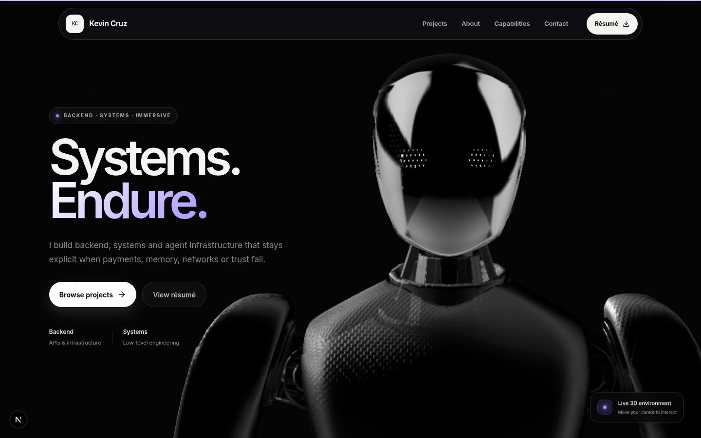

# Kevin Cruz T — Software Engineering Portfolio

A multi-page portfolio for Kevin Cruz T built around the exact content of the current résumé, a calm environmental art direction, a scroll-responsive landscape introduction, and a full-screen editorial project archive.



## Routes

| Route | Purpose |
| --- | --- |
| `/` | Extended landscape introduction with the résumé role and executive summary |
| `/projects` | Scroll-driven stack of the six résumé projects with one GitHub action each |
| `/about` | Executive summary, education, coursework and certifications |
| `/capabilities` | The seven technical-skill groups from the résumé |
| `/contact` | Email contact form backed by an SMTP API endpoint |

The résumé is the source of truth for factual portfolio content. Because it supplies one GitHub profile rather than individual repository URLs, each project uses that exact profile as its only outbound action.

## Local preview

```bash
npm ci
cp .env.example .env.local
npm run dev
```

Open [http://localhost:3000](http://localhost:3000).

Message delivery requires these server-side variables:

```dotenv
SMTP_HOST=
SMTP_PORT=587
SMTP_USER=
SMTP_PASS=
CONTACT_EMAIL=
```

The contact endpoint validates field lengths and email format, ignores honeypot submissions, escapes HTML, keeps credentials server-side, and uses the sender address only as `replyTo`.

## Verification

```bash
npm run lint
npm run typecheck
npm run build
npm test
npm audit --omit=dev
```

The Playwright suite covers every route, five target viewports, horizontal overflow, navigation, keyboard behavior, the email check/unlock flow, malformed API input, reduced-motion fallbacks, no-JavaScript project content, Axe accessibility checks, résumé delivery, the extended home stage, and the project stack.

## Visual system

- DM Sans throughout for a quiet, coherent editorial voice.
- Deep teal, cream, leaf green, and coral shared across every route.
- The supplied landscape is rendered through Next Image, with layered CSS hills, mist, leaves, birds, pointer depth, and scroll-linked movement.
- The project archive uses semantic articles inside a sticky stage. Its GPU-friendly transforms are driven directly by scroll position without another dependency.
- Reduced-motion users receive a static project grid and a still, fully readable landscape.

## Design and content records

- [`design-system/MASTER.md`](design-system/MASTER.md) defines the current visual and interaction system.
- [`CONTENT_INVENTORY.md`](CONTENT_INVENTORY.md) maps the current résumé facts to the portfolio.
- [`SOURCES.md`](SOURCES.md) records supplied references, assets, and implementation sources.
- [`resume/KevinCruz_Resume.html`](resume/KevinCruz_Resume.html) is the editable, ATS-oriented résumé source.
- [`public/KevinCruz_Resume.pdf`](public/KevinCruz_Resume.pdf) is the generated one-page A4 résumé downloaded by the portfolio.

## Stack

- Next.js App Router, React, and TypeScript
- Tailwind CSS v4 plus a custom token-driven CSS system
- Motion for shared progressive-enhancement behavior
- RequestAnimationFrame for the scroll-linked project and landscape scenes
- Nodemailer for server-side SMTP delivery
- Lucide icons
- Playwright and Axe for browser and accessibility checks

Google fonts are bundled through `next/font`; the site makes no font request to a third party at runtime.
