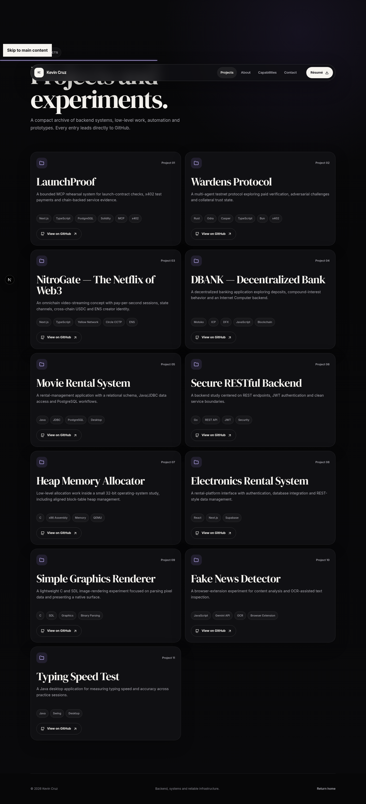
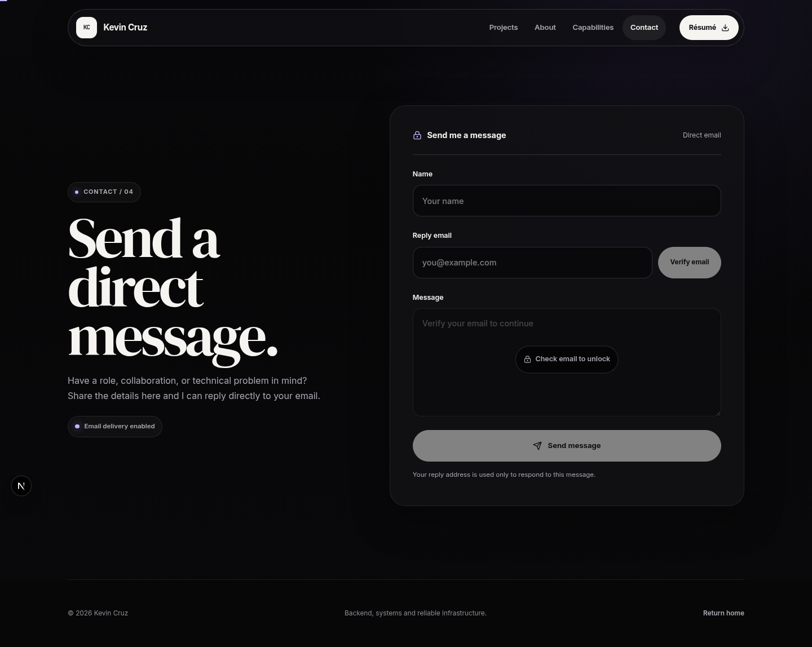
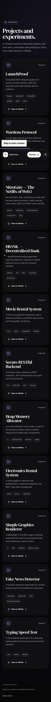

# Kevin Cruz — Engineering Portfolio

A multi-page portfolio for Kevin Cruz with a full-viewport interactive Spline hero, a restrained dark editorial component system, and a direct recruiter-readable information architecture.


## Routes

| Route | Purpose |
| --- | --- |
| `/` | Full-screen interactive 3D introduction with project and résumé actions |
| `/projects` | Compact project archive with one GitHub action per card |
| `/about` | Engineering direction, education and journey |
| `/capabilities` | Skills grouped by engineering function |
| `/contact` | Email contact form backed by an SMTP API endpoint |

The project archive intentionally behaves as a broad portfolio archive rather than a repository-verification ledger. Some older entries use the GitHub profile as a fallback when no dedicated repository URL is available, following the portfolio owner's stated preference.

## Local preview

```bash
npm ci
cp .env.example .env.local
npm run dev
```

Open [http://localhost:3000](http://localhost:3000).

The pages render without email credentials, but message delivery requires these server-side variables:

```dotenv
SMTP_HOST=
SMTP_PORT=587
SMTP_USER=
SMTP_PASS=
CONTACT_EMAIL=
```

The contact endpoint validates field lengths and email format, ignores honeypot submissions, escapes HTML, keeps credentials server-side and uses the sender address only as `replyTo`.

## Verification

```bash
npm run lint
npm run typecheck
npm run build
npm test
npm audit --omit=dev
```

The Playwright suite covers every route, five target viewports, horizontal overflow, page navigation, keyboard dismissal, skip-link focus, GitHub-only archive actions, the email check/unlock flow, malformed API input, reduced motion, no-JavaScript project content, Axe accessibility checks, résumé delivery, mobile hero ordering, full-viewport sizing and live Spline canvas initialization.

The Spline scene is loaded directly from its supplied production URL. A loading state preserves the full frame while the WebGL scene initializes; the rest of the site does not depend on that scene.

## Design and content records

- [`design-system/MASTER.md`](design-system/MASTER.md) defines the palette, typography, responsive rules, component behavior and motion policy.
- [`CONTENT_INVENTORY.md`](CONTENT_INVENTORY.md) records content decisions and the user-directed archive revision.
- [`SOURCES.md`](SOURCES.md) records design research, licenses and official implementation references.
- [`resume/Kevin_Cruz_Resume.html`](resume/Kevin_Cruz_Resume.html) is the editable source for [`public/Kevin_Cruz_Resume.pdf`](public/Kevin_Cruz_Resume.pdf).

## Screenshots

| Home | Projects |
| --- | --- |
|  |  |

| Contact | Mobile projects |
| --- | --- |
|  |  |

## Stack

- Next.js App Router, React and TypeScript
- Tailwind CSS v4 and a custom token-driven CSS system
- Spline React and runtime for the homepage WebGL environment
- Motion for progressive-enhancement animation
- Nodemailer for server-side SMTP delivery
- Lucide icons
- Playwright and Axe for browser and accessibility checks

Google fonts are bundled through `next/font`; the site makes no font request to a third party at runtime.
